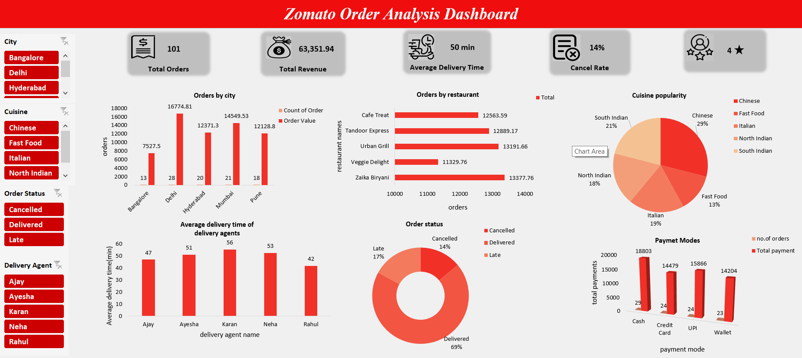

# 🍽️ Zomato Order Analysis Dashboard (Excel)

An interactive dashboard built using Microsoft Excel to analyze Zomato-style food delivery data across cities, agents, cuisines, and payment methods.

---

## 📊 Features

- ✅ KPI Cards: Total Orders, Revenue, Cancel Rate, Avg Delivery Time
- 📍 Orders by City and Restaurant
- 🍱 Cuisine Popularity (Pie Chart)
- 🚴 Agent-wise Delivery Time
- 💳 Payment Mode Analysis
- ❌ Order Status Breakdown (Doughnut Chart)
- 🔄 Slicers: City, Cuisine, Order Status, Delivery Agent

---

## 📁 Files Included

| File Name                           | Description                     |
|------------------------------------|---------------------------------|
| `Zomato_Order_Analysis_Dataset.xlsx` | Main Excel dashboard file        |
| `zomato_dashboard.png`              | Screenshot of dashboard layout   |

---

## 🛠 Tools Used

- Microsoft Excel  
  - PivotTables  
  - PivotCharts  
  - Slicers & Filtering  
  - Conditional Formatting  
  - Custom Theming

---

## 📷 Dashboard Preview

---

## 📬 Contact

**Sakshi Jadhav**  
[LinkedIn]([https://www.linkedin.com/in/sakshi-jadhav-21808b274/]) |sakshi302004@gmail.com
